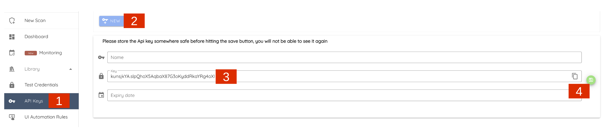
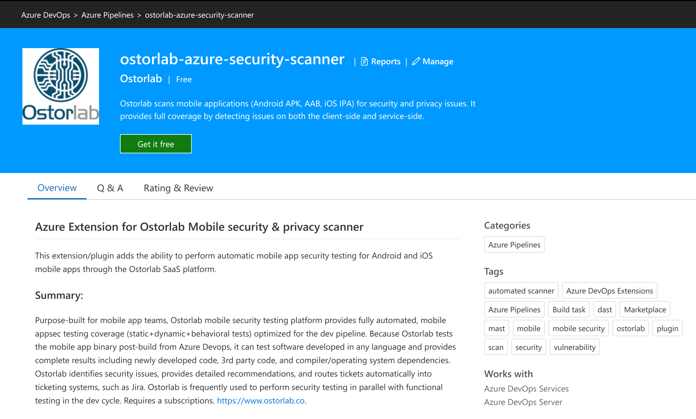
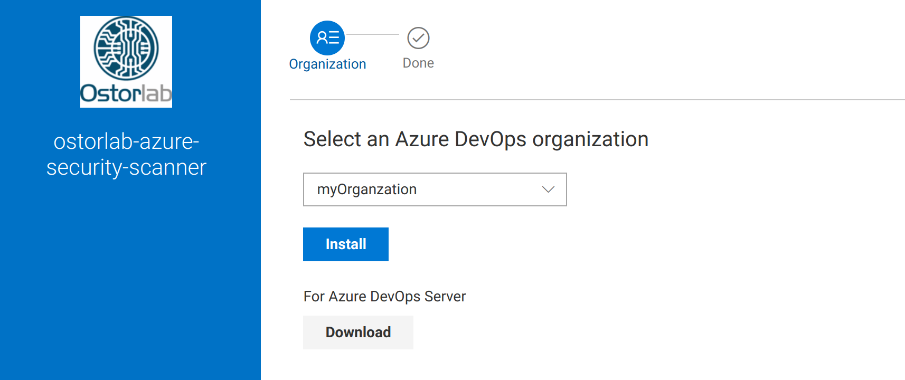
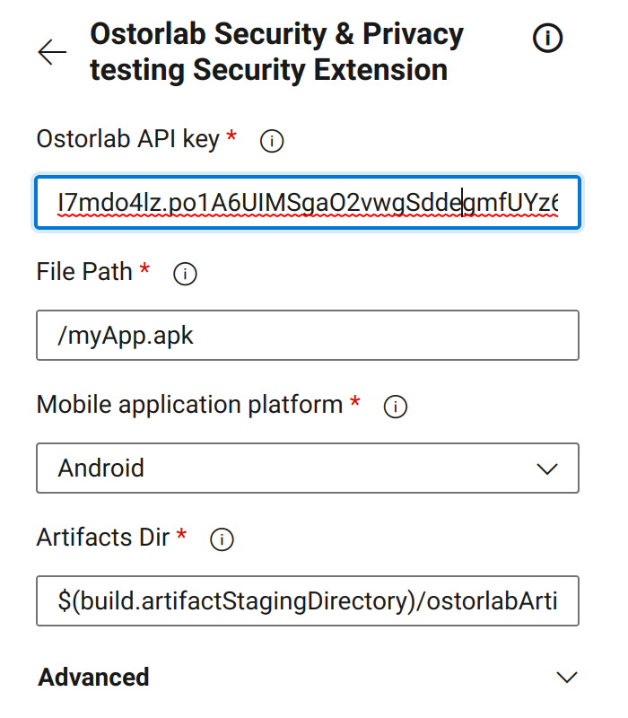
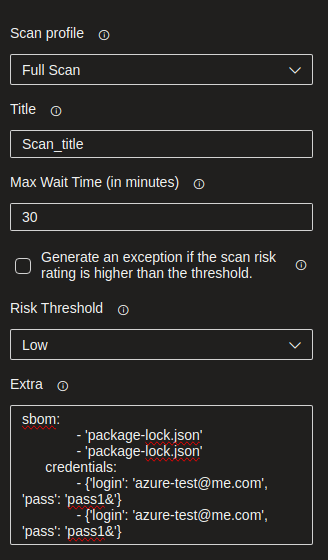
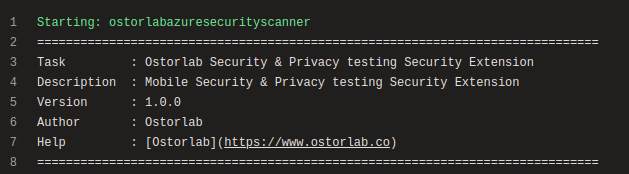
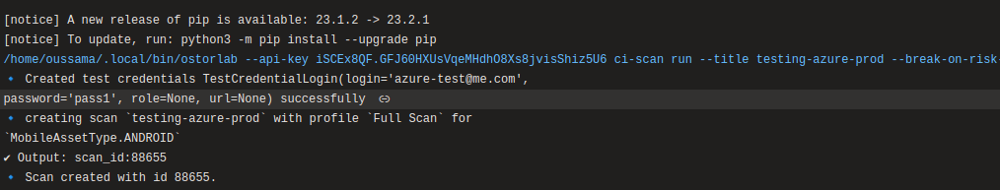

## Azure Extension for Ostorlab Mobile security & privacy scanner
This extension/plugin adds the ability to perform automatic mobile app security testing for Android and iOS mobile apps through the Ostorlab SaaS platform.

### Summary:
Ostorlab scans mobile applications (Android APK, AAB, iOS IPA) for security and privacy issues. It provides full coverage by detecting issues on both the client-side and service-side, covering both the application code and all of its dependencies.

Ostorlab supports all major frameworks, both native and multi-platform. This includes Java, Kotlin, Objective C, Swift, Flutter, Cordova, React Native, Ionic and Xamarin.

Ostorlab provides both static and dynamic analysis capabilities, detecting over 500 vulnerability classes, like hardcoded secrets, privacy data leakage, untrusted input inject, outdated dependencies with a database of over 120k known vulnerable dependency.

Requires a subscriptions. https://www.ostorlab.co.

## Job Parameters
Following are parameters needed for the job:

### Required environment variables
- `API_KEY` - Specifies your API key
- `FILE_PATH` - Specifies the path to the Android APK file or the iOS IPA file
- `PLATFORM` - Specifies the platform. Possible values: `android` or `ios


### Optional environment variables

- `OSTORLAB_SCAN_PROFILE` - Select the scan profile to run. You can choose between `Fast Scan` for rapid static analysis or `Full Scan` for full Static, Dynamic and Backend analysis.
- `OSTORLAB_TITLE` - Specifies the scan title
- `OSTORLAB_WAIT_FOR_RESULTS` - Set to `true` if you want to wait for the scan to finish and retrieve the result
- `OSTORLAB_WAIT_MINUTES` - Specifies the number of minutes to wait. Default value: `30`
- `OSTORLAB_BREAK_BUILD_ON_SCORE` - Set to `true` to generate an exception if the scan risk rating is higher than the threshold
- `OSTORLAB_RISK_THRESHOLD` - Specifies your risk rating threshold. Possible values: `LOW`

### API key

1. Go to the [API keys menu](https://report.ostorlab.co/library/api/keys)
2. Click the new button to generate a new key
3. Copy the API key (You can add a name and an expiry date to your key)
4. Click the save button to save your key


### Installation

Find it in [Azure Devops Marketplace](https://marketplace.visualstudio.com/azuredevops) using the keyword "Ostorlab"


Then install it as follows:


#### Add to your Build

#### Basic Config


#### Advanced Config


#### Sample Build Pipeline for Android
```
pool:
  vmImage: 'macos-latest'

steps:
- task: Gradle@2
  inputs:
    workingDirectory: ''
    gradleWrapperFile: 'gradlew'
    gradleOptions: '-Xmx3072m'
    publishJUnitResults: false
    testResultsFiles: '**/TEST-*.xml'
    tasks: 'assembleDebug'
- task: CopyFiles@2
  inputs:
    contents: '**/*.apk'
    targetFolder: '$(build.artifactStagingDirectory)'
- task: PublishBuildArtifacts@1
  inputs:
    pathToPublish: '$(build.artifactStagingDirectory)'
    artifactName: 'drop'
    artifactType: 'container'
- task: ostorlab-azure-security-scanner@1
  inputs:
    apiKey: 'I7mdo4lz.XXXXXXXXXX'
    filepath: '/dev/myApp.apk'
    platform: 'android'
    artifactsDir: '$(build.artifactStagingDirectory)/ostorlabArtifacts'
```

The task will start as follow:  


Then, the console will print the logs of the different steps: Uploading the application binary, creating a scan and waiting for the results.  




Notes:
1. "task: ostorlab-azure-security-scanner@1" is the main task for security analysis. The other tasks above are used to generate the Android apk file.
2. If you set the _Wait for the scan to finish and retrieve the results_ option, & the scan took more than the provided _Max wait time_, the pipline will fail.
